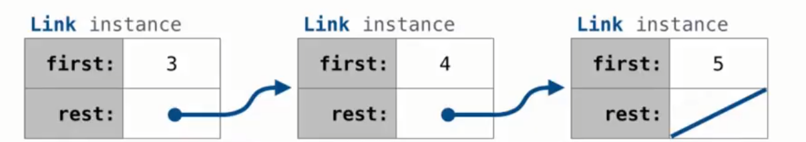

# 面对对象编程 Object-Oriented Programming

一个对象储存这个东西的所有信息，也可以执行相关的计算。

面对对象编程：程序是一堆不同的对象彼此交互，而非长长的信息列表

- 每个对象都有自己的本地状态(local state)，随着时间推移可能变化。
- 每个对象应该知道如何管理自己的本地状态
- 通过**methods**(即对象内部的函数)来与对象交互
- 多个对象可能是属于同一个类(**class**)的的实例

- 不同的类可能相互有关系


类(**class**)定义了特定类型对象的行为

对象(**objects**)是类的**实例**，每个对象都有它的类

方法(**methods**)是使用点表达式在对象上调用的函数

````python
>>> list
<class 'list'>
>>> s = list(range(3))#创建一个list的实例
>>> s
[0, 1, 2]
>>> type(s)
<class 'list'>
````

### Classes

类描述它的实例的行为

类有**属性(attributes)**和**方法(methods)**

````python
class Account:
    def __init__(self, account_holder):
        self.balance = 0
        self.holder = account_holder
#__init__是一个特殊的方法的名字，永远都是这么写的，表示在创建实例时会发生什么
#self为调用该方法的实例
#在调用时只用一个参数，但是在定义时用两个参数，这样可以访问该实例的所有属性
	def deposit(self, amount):
        self.balance += amount
		return self.balance
	def withdraw(self, amount):
        if amount > self.balance:
            return 'Insufficient funds'
        else :
            self.balance -= amount
            return self.balance
````

### 创建实例

当一个类被调用创建实例时：

1. 一个空的新的实例被创建
2. __ init __method被调用，新创建的对象作为第一个他的第一个参数，其他参数为调用时提供的参数

### 实例的属性 

通过**点表达式**可以**访问和修改**对象的属性

注意：是**可以修改**的！都是**可变对象**！

````python
>>> a = Account('Alan')
>>> a.balance
0
>>> a.balance = 12
>>> a.balance
12
````

- 在python中，随时可以添加新属性

- 每个属性可以被赋值为任何值，可以是数字、也可以是其他对象

````python
>>> b = Account('Ada')
>>> b.balance = 20
>>> a.backup = b
>>> a.backup.balance
20
````

### 对象标识 Object Identity

这很重要，因为对象的属性时可以改变的，对象可以变异

-  每个用户定义类的对象都有唯一标识

-  可以通过**is**和**is not**判断是否为同一对象
-  使用赋值将对象绑定到新名称并不会创建一个新对象

### 方法

所有方法通过self参数访问对象，所以他们都可以访问和操作对象的属性，这是对象管理自己本地状态的机制

方法定义时有两个参数，但是使用点表达式自动提供了第一个参数。所以即使定义有两个参数，实际上调用只需要一个参数

# Class Attributes 类属性

在class里面的赋值和def语句创建类的属性，而不会在帧里面创建名字，而会将这些都作为类属性放到类里面。

类属性在类的**所有实例之间共享**，因为他们是类的属性而不是实例的属性。

````python
class Account:
    interest = 0.02 #类属性
    def __init__(self, holder):
        self.balance = 0
        self.holder = holder #每个实例的属性
````

# 属性查找 Attribute Lookup

每次评估点表达式会查找对象的属性

<expression>.<name>

expression提供对象，name提供要查找的属性的名称

实例和类都有属性，都可以被点表达式访问

点表达式查找顺序：先在**实例**里查找再在**类**里面查找，再到**基类**查找

#### getattr, hasattr函数

````python
tom_account = Account(tom)
>>> getattr(tom_account, 'balance')
10
>>> hasattr(tom_account, 'balance')
True
````

getattr查找属性的顺序和点表达式一样

# 属性赋值 Attribute Assignment

如果点表达式左侧的对象是实例，则设置实例的属性，

如果为类，则设置类的属性，赋值类属性后**所有实例会共享这个赋值**！！！

# 方法调用

同样通过点表达式调用类里的方法

````python
a = Account('a')
m = map(a.deposit, range(10, 20))
>>> a.balance = 30
>>> next(m)
40
>>> next(m)
51
````

方法的行为类似于函数

# 绑定方法

- 形如a.deposit就为一个绑定方法，通过点表达是连接对象和一个是方法的的属性来创建绑定方法。

- 绑定方法自动传入第一个参数为实例自身

Python区别**函数**和**绑定方法**：

绑定方法将函数和含有该方法的对象组合在一起

Object + Function = Bound Method

````python
>>> type(Account.deposit)
<class 'function'>
>>> type(tom_account.deposit)
<class 'method'>
````

这种区别说明有两种调用这个方法的方式：

1. 作为函数调用，需要手动传第一个参数
1. 作为绑定方法调用

````python
>>> Account.deposit(tom_account, 1011)
1011
>>> tom_account.deposit(1007)
2018
````

# Inheritance 继承

Inheritance是将多个类关联在一起的方法，因为有时候不同的类很相似。

一般使用：两个类很相似，在特殊化程度有所差别。

特殊化的类可能具有与通用类相同的所有属性，也会有一些特殊行为。(比如植物大战僵尸的不同等级的僵尸)

````python
Class <name>(<base class>):
    <suite>
````

这样写这个类可以继承基类的内容。内容也可覆盖修改，未修改的保持不变。所以只需要写出不同的地方 。

 ````python
class CheckingAccount(Account):
    """一个对取钱收费的账户"""
    withdraw_fee = 1
    interest = 0.01
    def withdraw(self, amount):
        return Account.withdraw(self, amount + self.withdraw_fee)
 ````

- 基类的属性**不会被拷贝**到子类里。

查找class里的一个name：

1. 这个name命名的是类存在的属性，返回属性值。
2. 在基类中查找这个name(也会在基类的基类找...)

````python
>>> ch = CheckAccount('Tom') #调用的是Account.__init__
>>> ch.interest #是CheckAccount里的属性
````

### 多重继承

一个子类可以有多个基类

## super()函数

super函数用于**调用**父类的方法，最常用于子类的\_\_init\_\_中

````python
class Account:
    def __init__(self, balance = 0):
        self.balance = balance
        
class Rich_Account(Account):
    def __init__(self, balance = 3):
        super().__init__(balance)
````

注意！使用super调用父类的函数不会自己return，如果要return的话应该写

````python
return super()...
````

# 面向对象设计

- 不要重复你自己，尽可能使用现有的实现。
- 对于在子类被覆盖了的属性，仍应该要能通过基类访问原属性。
- 尽量查找实例上的属性，而非使用硬编码

### 继承和组合

继承：表示 is - a 关系 一个对象继承另一个对象

- a checking account is a type of account

组合：表示 has - a关系 一个对象包含另一个对象

- bank has a bank account

````python
class Bank:
    """a bank *has* accounts"""
    def __init__(self):
        self.accounts = []
        
    def open_account(self, holder, amount, kind = Account):
        account = kind(holder)
        account.deposit(amount)
        self.accounts.append(account)
        return account
    
    def pay_interest(self):
        for a in self.accounts:
            a.deposit(a.balance * a.interest)
        
````

# 字符串表示 String Representations

在python里，所有对象都有两种字符串表示：

- str 给人读
- repr 给python解释器读

一般str和repr相同，但也可能不同

## repr

repr(object) -> string

返回对象的规范字符串表示

调用repr的结果就是python在interactive session交互式会话中打印的字符串

可以对repr的结果调用eval()获得原对象

````python
>>> repr(12e12)
'12000000000000.0'
>>> print(repr(12e12))
12000000000000.0
````

有些对象没有一个简单的python可读字符串，无法用一个表达式简单表示

````python
>>> repr(min)
'<built-in function min>'
````

## str

````python
>>> from fractions import Fraction
>>> half = Fraction(1, 2)
>>> repr(half)
'Fraction(1, 2)'
>>> str(half)
'1/2'
````

对某个表达式的值调用str的结果就是用print打印的字符串

````python
>>> s = 'Hello, World'
>>> repr(s)
"'Hello, World'"#注意有两层引号
>>> eval(repr(s))
'Hello, World'

>>> str(s)
'Hello, World'
>>> print(s)
Hello, World
````

# F-strings

在字符串中插入表达式的一种方法

使用字符串连接：

````python
>>> from math import pi
>>> 'pi starts with ' + str(pi) + '...'
'pi starts with 3.1415925653589793...'
````

**使用字符串插值(f-string)：**

````python
>>> f'pi starts with {pi}...'
'pi starts with 3.1415925653589793...'
````

使用大括号包括要插入的表达式，插入的是该表达式的str字符串

````python
>>> half = Fraction(1, 2)
>>> f'half is {half}.'
'half is 1/2.'
>>> f'half is {repr(half)}'
'half is Fraction(1, 2)'
````

注意：在F字符串里调用表达式也会有**副作用**，会导致**变异**

还有一种方法:

在字符串中加{}，中间是索引，然后后面.format()里面加表达式

````python
>>> 'Fraction({0}, {1})'.format(1, 2)
'Fraction(1, 2)'
````


# 多态函数 Polymorphic Functions

适用于多种数据类型的函数，比如str和repr

````python
def repr(x):
    return type(x).__repr__(x)
#要传入x因为这个是类属性不是实例属性，不会自己传入self
````

## Interfaces 接口

接口是一组共享消息（各个类共有的属性）和一些规范

比如：\_\_repr\_\_和\_\_str\_\_就实现了创建字符串表示的接口

# 特殊方法名

有些名字是特殊的因为他们有内置行为

这些名字都以'__'包围

- \_\_init\_\_ ：在对象构造时自动调用
- \_\_repr\_\_ ： 生成表示对象字符串的方法
- \_\_add\_\_ ：将一个对象添加到另一个对象中(也就是定义对两个对象中间使用 + 会返回什么)
- \_\_radd\_\_ : 将一个对象添加到另一个对象中，但是self在加号右边
- \_\_bool\_\_ ：将对象转化成布尔值 也就是对该对象调用bool()返回什么
- \_\_float\_\_ ：将的对象转化为float 也就是对该对象调用float()返回什么

````python
>>> zero, one, two = 0, 1, 2
>>> one + two 
3
>>> bool(zero), bool(one)
(False, True)
#其实是运行：
>>> one.__add__(two)
3
>>> zero.__bool__(), one.__bool__()
(False, True)
````

通过这些函数规定使用内置语法的结果，这也是在使用接口允许对象与python内置系统交互


# 链表 linked list

链表要不是空，要不是第一个(索引为0)**值**和剩下的**链表**部分(也可能为空)

例：

3，4，5   ->  [3, [4, [5]]]


````python
Link(3, Link(4, Link(5, Link.empty)))
````
其中第一个值为5的那个链表(最内层)的剩余部分为link.empty
````python
class Link:
    empty = ()
    def __init__(self, first, rest = empty):
        assert rest is Link.empty or isinstance(rest, Link)
        #注：isinstance如果是子类的实例也是True
        self.first = first
        self.rest = rest
        
````

## 递归链表处理

````python
def range_link(start, end):
    if start >= end:
        return Link.empty
    else :
        return Link(start, range_link(start + 1, end))
    
def map_link(f, s):
    if s is Link.empty:
        return s
    else :
        return Link(f(s.first), map_link(f, s.rest))
    
    
def filter_link(f, s):
    if s is Link.empty:
        return s
    filtered_rest = filter_link(f, s.rest)
    if f(s.first) == True:
        return Link(s.first, filtered_rest)
    else :
        return filtered_rest
````

## 链表变异

例：

#### 添加一个数到有序链表中

如果已经有了就不改变

````python
def add(s, v):
    """add v to s, return modified s"""
    assert s is not Link.empty
    if s.first > v:
        s.first, s.rest = v, Link(s.first. s.rest) #这样写可行因为会先计算右边两个都计算，再赋值
    elif s.first < v and empty(s.rest)
        s.rest = Link(v)
    elif s.first < v:
        s.rest = add(s.rest, v)
    return s
````

# 树 (类)

树有一个 label 和多个branches 每个branch 都是 tree

````python
class Tree:
    def __init__(self, label, branches = []):
        self.label = label
        for branch in branches:
            assert isinstance(branch, Tree)
        self.branches = list(branches)
        
    def __str__(self):
        return '\n'.join(self.indented())
    def indented(self):
        lines = []
        for b in self.branches:
            lines.append('  ' + b.indented())
		return [str(self.label)] + lines
    
    def is_leaf(self):
        return not self.branches
````

````python
def leaves(t):
    """return a list of all leaf labels in Tree t"""
    if t.is_leaf():
        return [t.label]
    else :
        all_leaves = []
        for b in t.branches:
            all_leaves.extend(leaves(b))
        return all_leaves
````

````python
def height(t):
    if t.is_leaf:
        return 1
    else :
        return 1 + max(height(b) for b in t.branches)
````

## 树的变异

例：修建树

````python
def prune(t, n):
    """prune all sub_trees whose label is n"""
    #只要出现n，后面连着的也一并修剪掉
    t.branches = [b for b in t.branches if b.label != n]
    for b in t.branches:
        prune(b, n)
````

# 效率

可以写一个修饰器count来计算调用函数的次数

````python
def count(f):
    def counted(n):
        counted.call_count += 1
        return f(n)
    counted.call_count = 0 #要用属性来写，这样函数内部才能修改
    return counted
````

## 记忆化

````python
def memo(f):
    cache = {}
    def memomized(n):
        if n not in cache:
            cache[n] = f(n)
        return cache[n]
    return memomized
````

## 乘方

````python
def exp(b, n):
    if n == 0:
        return 1
    else :
        return b * exp(b, n-1)
#时间随n线性增长
    
def exp_fast(b, n):
    if n == 0:
        return 1
    elif n % 2 == 0:
        return square(exp_fast(b, n//2))
    else :
        return b * exp_fast(b, n-1)
#时间随n对数增长
    
def square(x):
    return x * x
````

## 时间增长顺序的符号

O:最多需要这么多时间，也可能少于

O(b^n), O(n^2), O(n), O(log n), O(1)

\theta :最多是这个量级，最少也是这个量级

## 快速查找重复数字

````python
def overlap(s, t):
    """For increasing s and t, count the numbers that appear in both.

    >>> a = Link(3, Link(4, Link(6, Link(7, Link(9, Link(10))))))
    >>> b = Link(1, Link(3, Link(5, Link(7, Link(8)))))
    >>> overlap(a, b)  # 3 and 7
    2
    >>> overlap(a.rest, b)  # just 7
    1
    >>> overlap(Link(0, a), Link(0, b))
    3
    """
    "*** YOUR CODE HERE ***"
    curr_a = a
    curr_b = b
    total = 0
    while curr_a is not Link.empty and curr_b is not Link.empty:
        if curr_a.first == curr_b.first :
            total += 1
            curr_b = curr_b.rest
            curr_a = curr_a.rest
        elif curr_a.first > curr_b.first:
            curr_b = curr_b.rest
        elif curr_a.first < curr_b.first:
            curr_a = curr_a.rest
    return total
````

这样的是时间复杂度O(n + m),空间复杂度O(1)，双指针法，很好的方法，注意前提：排好序

# 模块化设计

## 关注点分离


