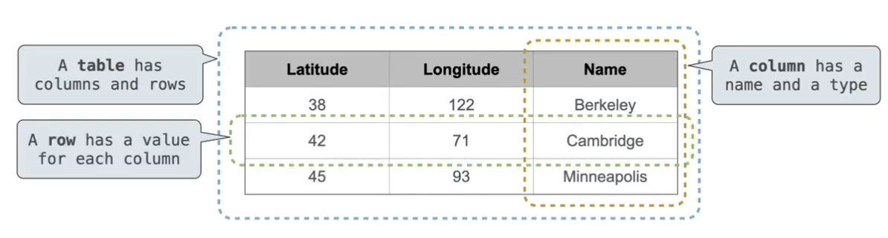
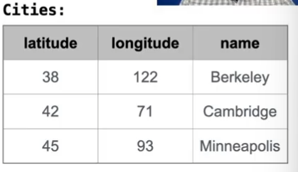
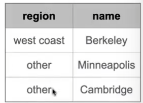

# 数据库 Database

## 数据库管理系统(DBMS)

数据库通过表格(table)管理数据

表格由记录(records)组成，记录是表中的行，每一列都有一个值



结构化查询语言(The Structured Query Language (SQL))可能是最广泛使用的编程语言，他从现有表中生成新表，然后操作其内容。

SQL是一种声明式declarative编程语言

## 声明式编程Declarative Programming

生成性语言：如SQL, Prolog

- 一个程序是对期望结果的描述
- 解释器负责找出如何生成这个结果

命令式语言：如Python, Scheme

- 一个程序是对计算过程的描述
- 解释器执行和评估该过程的规则

SQL：

````sql
create table cities as
	select 38 as latitude, 122 as longitude, "Berkeley" as name union
	select 42,             71,                "Cambridge"          union
	select 45,             93,                "Minneapolis";
````



````sql
select "west coast" as region, name from cities where longitude >= 115 union
select "other"               , name from cities where longitude < 115;
````




# SQL

## SQL总览

#### select语句

select语句创建一个新的表，可以从头开始，也可以通过投影表创建

#### create table语句

给一个表赋予全局名称

#### 其他语句

**analyze, delete, explain, insert, replace, update...**

- 大部分重要的操作都在**select**语句中

## Select

select语句永远包括一个用逗号分割的列描述列表。

列描述可以是一个表达式，可选择跟随**as**和一个列的名称。

以分号结束一个select语句。

````sql
select [expression] as [name], [expression] as [name];
````

如果select字面值，将创建一个一行的表

可以联合两个select语句创建两行的表，但只能联合具有相同列数和每列中相同类型信息的表，但是列的名称将使用第一个select语句中的列名称

````sql
select "abrahamm" as parent, "barack" as child union
select "abaraham"          , "clinton"         union
...
select "eisenhower"        , "fillmore";
````

## 命名表格

SQL常常被用作交互式语言。

select语句的结果将显示给用户，但不会储存。

**create table **语句将给这个结果一个名字,就可以储存了。

````sql
create table [name] as [select statement];
````

## 投影表格

选择语句可以将现有的表投影到新表中：

- 可以使用**from**子句指定输入
- 可以使用**where**子句选择输入表的行 的子集
- 可以使用**order by**子句声明剩余行的排序

列描述决定了每个输入的行如何投影到结果行,一般就是写要输入的列的名字

````sql
select [columns] from [table] where [condition] order by [order]
````

````sql
select child from parents where parent = "abraham";
````

## 算术运算

在select表达式中，列的名字(column names)被评估为行值(row values)

算术表达式可以结合行值和常数

```sql
create table lift as
	select 101 as chair, 2 as single, 2 as couple union
	select 102         , 0          , 3           union
	select 103         , 4          , 1;
```

````sql
select chair, single + 2 * couple as total from lift;
````

## 连接两个表

用逗号连接两个表**A**和**B**，得到A的一行和B的一行的**所有组合**

````SQL
select * from parents, dogs where child = name and fur = "curly";
````

=>

| parent     | child    | name     | fur   |
| ---------- | -------- | -------- | ----- |
| eisenhower | fillmore | fillmore | curly |
| delano     | herbert  | herbert  | curly |

### 别名和点表达式

两个表可能有相同的列的名字，点表达式和别名用于消除歧义

````sql
select a.child as first, b.child as second
	from parents as a, parents as b
	where a.parent = b.parent and a.child < b.child
````

| first | second |
| ----- | ------ |
| ...   | ...    |

### 连接多个表

sql也可以连接多个表

 ## 数字表达式

sql的数字表达式和python的类似

在所有的表达式中，你可以：

- 进行+, -, *, /, %, and, or等运算
- abs，round，not，- 转化一个数字
- 比较值：<, <=, >, >=, <>(不等于), !=, =(注意这个是一个等号)

## 字符串表达式

字符串值可以通过连接运算符合成更长的值

````sql
sqlite> select "hello," || " world"
hello, world
````

有些内置的字符串操作:

````sql
sqlite> create table phrase as select "hello, world" as s;
sqlite> select substr(s, 4, 2) || substr(s, instr(s, " ") + 1, 1) from phrase;
low
````

从第四个开始取两个:"lo"    加上从遇到空格开始后面一个开始取一个:"w"

注意索引不是从零开始

你其实也可以用sql来表示结构化的值(如链表)， 但一般不是个好主意

````sql
sqlite> create table lists as select "one" as car, "two, three, four" as cdr;
sqlite> select substr(cdr, 1, instr(cdr, ",") - 1) as cadr from lists;
two
````

## 聚合 Aggregation

至今为止，所有SQL表达式一次只引用一行的值

`select [colomns] from [table] where [expressions] order by [expression]`

**聚合函数在`[columns]`子句中计算一组行的值**

````sql
create table animals as
  select "dog" as kind, 4 as legs, 20 as weight union
  select "cat"        , 4        , 10           union
  select "ferret"     , 4        , 10           union
  select "parrot"     , 2        , 6            union
  select "penguin"    , 2        , 10           union
  select "t-rex"      , 2        , 12000;
````

````sql
select max(legs) from animals;
````

| max(legs) |
| --------- |
| 4         |

````sql
sqlite> select max(legs - weight) + 5 from animals;
1
sqlite> select max(legs) - min(weight) from animals;
-2
sqlite> select min(legs), max(weight) from animals where kind <> "t-rex";
2|20
sqlite> select count(*) from animals;
6 ...计算有多少行
sqlite> select count(distinct weight) from animals;
4
````

**聚合函数还会选择表中的特定行， 并对你要求聚合的值进行聚合， 该行可能是有意义的。**

````sql
sqlite> select max(weight), kind from animals;
12000|t-rex
# 这个t-rex是有意义的
sqlite> select avg(weight), kind from animals;
2009.3333333333333|cat
# 这个的第二项是没有意义的，随便给的
````

## Groups 组

聚合函数获取来自组中所有行的某个表达式的所有值，并对他们执行某些操作

默认情况下，用于计算最终表的所有行（即通过where子句中过滤器的行）都属于同一组，即一个大组

### Grouping rows

表中的行可以被分组在一起，聚合实际上是在每个组上单独执行的。

另一种select：

`select [columns] from [table] group by [expression] having [expression];`

**组的数量决定于expression的唯一值数量，即`count(expression)`**

````sql
sqlite> select legs, max(weight) from animals group by legs;
2|12000
4|20
sqlite> select legs, count(*) from animals group by legs;
2|3
4|3
sqlite> select legs, weight from animals group by legs, weight;
2|6
2|10
2|12000
4|10
4|20
````

**一个having字句用于过滤我们保留用于聚合的组**

````sql
sqlite> select weight/legs, count(*) from animals group by weight/legs having count(*) > 1;
2|2
5|2
````

## Create Table

`create table (if not exists) [table-name] ` +

`([column-def], ~)` or

`AS [select statement]`

**column-def:** 

`[column-name] ([column-constraint列约束])`

**column-constraint:**

- `UNIQUE`  指定值是唯一的，如果你尝试在同一列插入相同的值两次，就会报错

- `DEFALUT [signed-number]/[literal-value]`  为列指定默认值

例：

````sql
CREATE TABLE numbers (n, note);
````

````sql
CREATE TABLE numbers (n UNIQUE, note);
````

````sql
CREATE TABLE numbers (n, note DEFAULT "No comment")
````

意思是创建了一个表，有两列，一列叫n，一列叫note，后面可以跟UNIQUE说明唯一，可以跟DEFAULT指定默认值，这个表暂时只有列的名字，没有具体值。

## Drop Table

`DROP TABLE (IF EXISTS) [table-name]`

## Modifying table

### Insert

`INSERT INTO [table-name] ([column-name, ~]) ` +

`VALUES ([expr], ~), ~`每个括号集创建一个新行，用逗号分隔的是该行中列的值 

 or

`[select-stmt]`

**只想插入一列：**

````sql
INSERT INTO t(column) VALUES (value);
````

但是会插入一整行，剩下的列用默认值填充

````sql
sqlite> CREATE TABLE primes(n UNIQUE, prime DEFAULT 1);
sqlite> INSERT INTO primes VALUES (2, 1), (3, 1), (4, 1);
sqlite> select * from primes;
2|1
3|1
````

### Update 更新已有行的内容

`UPDATE [qualified-table-name] SET column-name = expr , ~  WHERE expr`

````sql
sqlite> UPDATE primes SET prime = 0 where n % 2= 0 AND n > 2;
sqlite> select * from primes ;
2|1
3|1
4|0
````

### Delete

`DELETE FROM [qualified-table-name] (WHERE expr)`

````sql
sqlite> DELETE FROM primes WHERE prime = 0;
sqlite>  select * from primes ;
2|1
3|1
````

# Python and SQL

````python
import sqlite3

db = sqlite3.Connection("n.db")
db.execute("CREATE TABLE nums SELECT 2 UNION SELECT 3;")
db.execute("INSERT INTO nums VALUES (?), (?), (?)", range(4, 7))
print(db.execute("SELECT * FROM nums;").fetchall()) # .fetchall表示用元组形式表示行
db.commit() #保存修改
````

# Databases Connections

不同的客户端，不同的程序对一个数据库操作

## Casino Blackjack 二十一点

